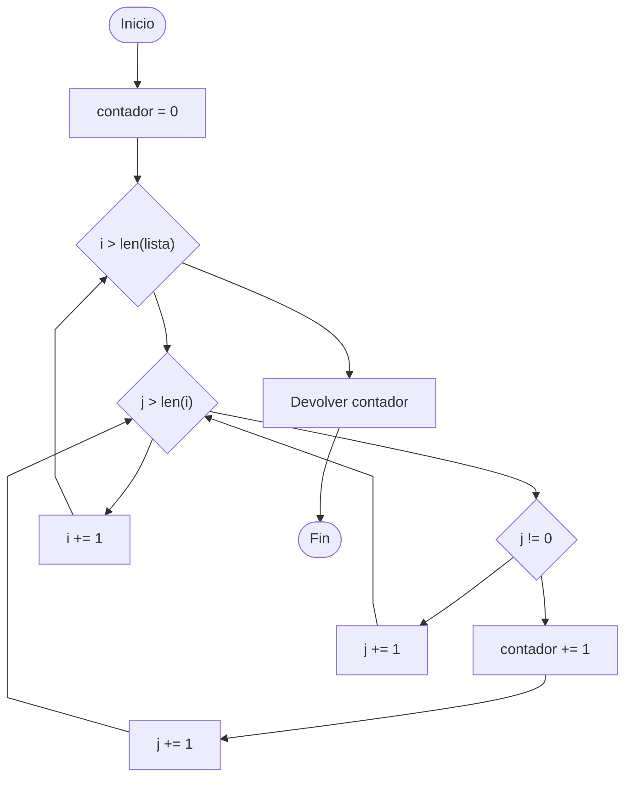
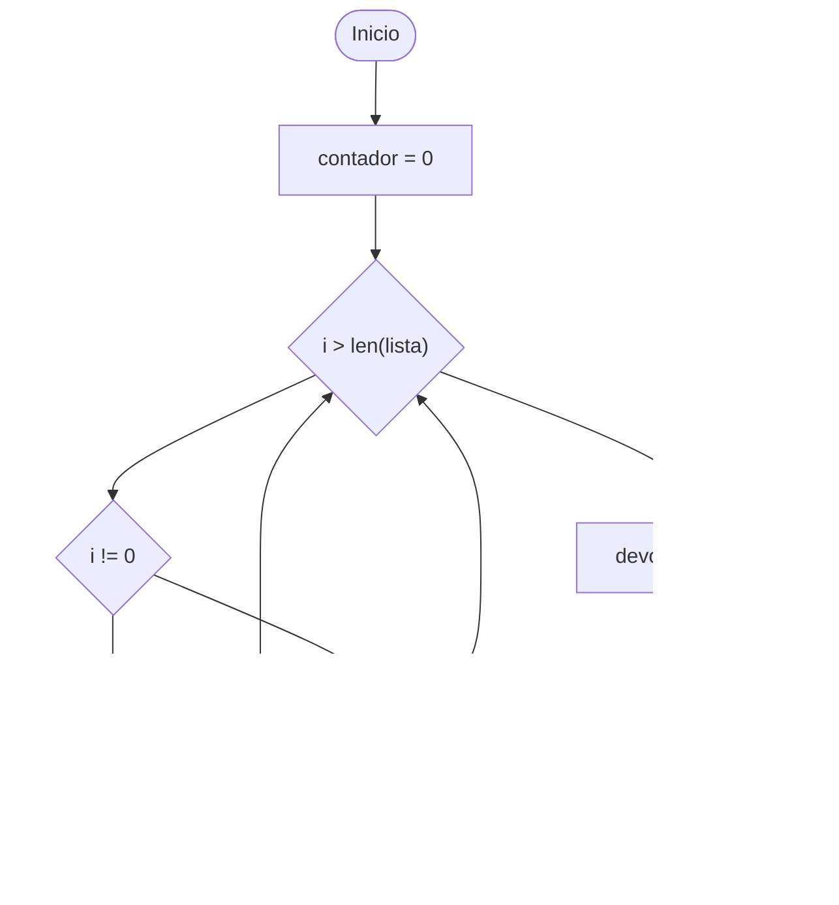
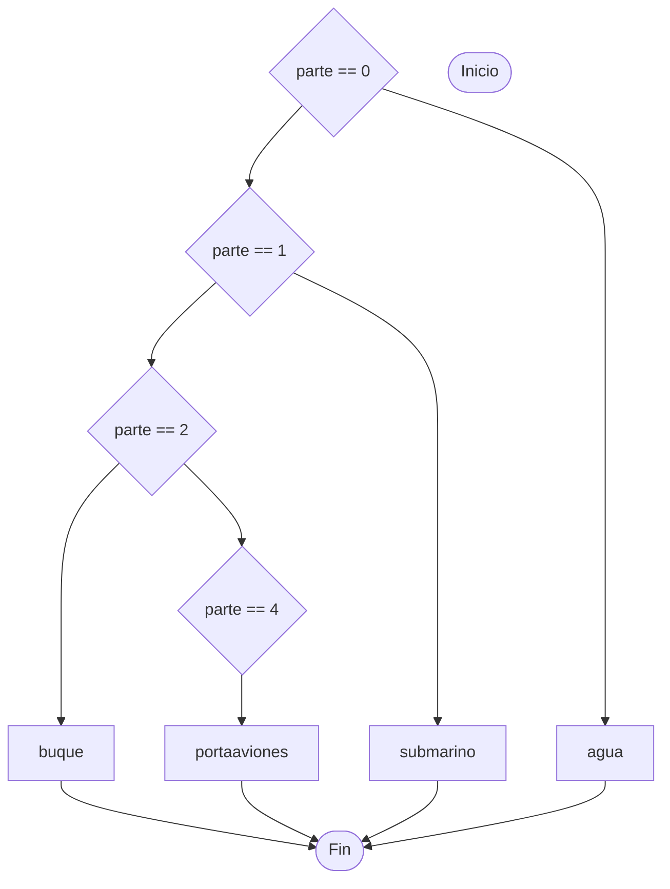

# Hundir la flota

## recorrer_tablero()

```mermaid
flowchart TB
    A(["Inicio"]) --> n1["contador = 0"]
    n1 --> n2["i &gt; len(lista)"]
    n2 --> n3["j &gt; len(i)"] & n15["Devolver contador"]
    n3 --> n6["j != 0"] & n14["i += 1"]
    n6 --> n9["contador += 1"] & n7["j += 1"]
    n9 --> n8["j += 1"]
    n14 L_n14_n2_0@--> n2
    n8 L_n8_n3_0@--> n3
    n7 L_n7_n3_0@--> n3
    n15 --> n16(["Fin"])
    n1@{ shape: rect}
    n2@{ shape: diam}
    n3@{ shape: diam}
    n15@{ shape: rect}
    n6@{ shape: diam}
    n14@{ shape: rect}
    n9@{ shape: rect}
    n7@{ shape: rect}
    n8@{ shape: rect}
    L_n14_n2_0@{ curve: linear } 
    L_n8_n3_0@{ curve: linear } 
    L_n7_n3_0@{ curve: linear }

```
## recorrer_fila()

```mermaid
flowchart TB
    A(["Inicio"]) --> n1["contador = 0"]
    n1 --> n2["i &gt; len(lista)"]
    n2 --> n3["i != 0"] & n7["devolver contador"]
    n6["contador += 1"] --> n5["i += 1"]
    n3 --> n6 & n4["i += 1"]
    n5 --> n2
    n4 --> n2 & n9["Untitled Node"]
    n7 --> n8(["Fin"])
    n8 --> n10["Untitled Node"]
    n1@{ shape: rect}
    n2@{ shape: diam}
    n3@{ shape: diam}
    n7@{ shape: rect}
    n6@{ shape: rect}
    n5@{ shape: rect}
    n4@{ shape: rect}

```

## que_navio_es()

```mermaid
flowchart TB
    n1["parte == 0"] --> n5["agua"] & n4["parte == 1"]
    n4 --> n6["submarino"] & n3["parte == 2"]
    n3 --> n7["buque"] & n2["parte == 4"]
    n2 --> n8["portaaviones"]
    n7 --> n9(["Fin"])
    n8 --> n9
    n6 --> n9
    n5 --> n9
    A(["Inicio"])
    n1@{ shape: diam}
    n5@{ shape: rect}
    n4@{ shape: diam}
    n6@{ shape: rect}
    n3@{ shape: diam}
    n7@{ shape: rect}
    n2@{ shape: diam}
    n8@{ shape: rect}

```